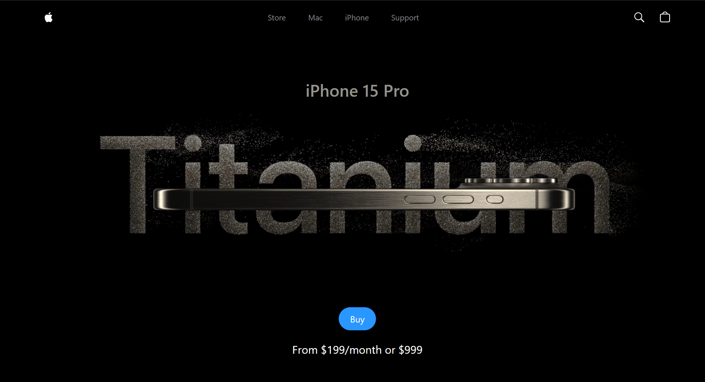

## Apple website with Three Js and Vite React

Url = https://apple-632e0.web.app/

<div align="center">
<a href="https://github.com/Sumonta056/FixHub-Issue-Tracker-Website" target="blank">

</a>

<h2> Project Name : Apple </h2>




</div>

## 💡 Overview

FixHub is a powerful and intuitive issue tracker built using Next.js and SQL, designed to streamline bug management and project tracking. With a focus on efficiency and user-friendliness, FixHub allows for seamless creation, viewing, updating, and deletion of issues. Key features include:

## ✨ Features

- **🔐 User Authentication:** Secure login with personalized access levels.
- **🌍 Issue Management:** Create, view, update, and delete issues; assign tasks to team members.
- **🔍 Filtering & Sorting:** Advanced options to quickly find and prioritize tasks.
- **📄 Pagination & Analytics:** Navigate large lists and gain insights with charts and dashboards.
- **🎯 Production Optimization:** Built for speed and reliability in production environments.
- **🔧 Customization:** Tailor settings and configurations to your needs.
- **📱 Responsive Design:** Access on any device with adaptive design.

Whether you're a solo developer or part of a large team, FixHub is the perfect tool for tracking and resolving issues with ease.🐞

## 👩‍💻 Tech Stack

- **Three.js**: A powerful JavaScript library for creating 3D graphics in the browser using WebGL.
- **GSAP**: A high-performance animation library for building fluid, complex animations in JavaScript..
- **React**: A declarative, component-based JavaScript library for building interactive user interfaces..
- **Npm Package**: A fast JavaScript runtime that includes a package manager, task runner, and more.

## 📖 Sources and external API's

- [NASA](https://www.nasa.gov) for space exploration and research
- [National Geographic](https://www.nationalgeographic.com) for nature and science articles
- [Stack Overflow](https://stackoverflow.com) for programming questions and answers
- [Wikipedia](https://www.wikipedia.org) for a wide range of information on various topics

## 📦 Getting Started

To get a local copy of this project up and running, follow these steps.

### 🚀 Prerequisites

- **Node.js** (v16.x or higher) and **npm** or **yarn**.
- **Npm** If you prefer using npm for package management and running scripts.

## 🛠️ Installation

1. **Clone the repository:**

   ```bash
   git clone https://github.com/Arty27/apple-iPhone.git
   cd readme-template
   ```

2. **Install dependencies:**

   Using Npm:

   ```bash
   npm install
   ```


3. **Start the development server:**

   ```bash
   npm run dev
   ```

## 📖 Usage

### ✔ Running the Website

- **Development mode:** `npm run dev`, `yarn dev`, or `bun dev`.
- **Production mode:** `npm run build && npm start`, `yarn build && yarn start`, or `bun run build && bun start`.

> Open [http://localhost:3000](http://localhost:3000) to view the app in your browser.

### 📃 API Documentation

The API documentation for this application is available at [http://localhost:3000/api/docs](http://localhost:3000/api/docs). It details all endpoints and their usage.

## 🤝 Contributing

We welcome contributions to this project. Please follow these steps to contribute:

1. **Fork the repository.**
2. **Create a new branch** (`git checkout -b feature/your-feature-name`).
3. **Make your changes** and commit them (`git commit -m 'Add some feature'`).
4. **Push to the branch** (`git push origin feature/your-feature-name`).
5. **Open a pull request**.

Please make sure to update tests as appropriate.

## 🐛 Issues

If you encounter any issues while using or setting up the project, please check the [Issues]() section to see if it has already been reported. If not, feel free to open a new issue detailing the problem.

When reporting an issue, please include:

- A clear and descriptive title.
- A detailed description of the problem.
- Steps to reproduce the issue.
- Any relevant logs or screenshots.
- The environment in which the issue occurs (OS, browser, Node.js version, etc.).

## 📜 License

Distributed under the MIT License. See [License](/LICENSE) for more information.
