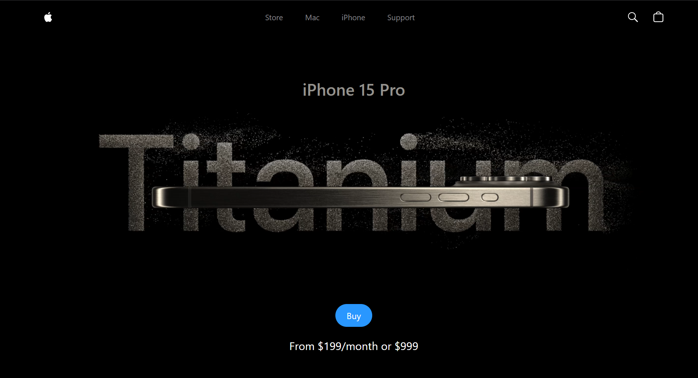

# Apple iPhone 15 Pro — 3D Website Clone

[](https://react.dev)
[](https://threejs.org)
[](https://gsap.com)
[](https://vitejs.dev)
[](https://tailwindcss.com)

🔗 **Live Demo:** [apple-632e0.web.app](https://apple-632e0.web.app)

---

<div align="center">
   
</div>

## Overview

A pixel-faithful recreation of Apple's iPhone 15 Pro product page, 
built to explore advanced frontend techniques — specifically 3D model 
rendering in the browser and scroll-driven animation sequences.

This project demonstrates real-world use of Three.js for interactive 
3D rendering, GSAP for high-performance animation timelines, and React 
for component architecture — all bundled with Vite for fast development 
and production builds.

---

## Features

- **Interactive 3D iPhone Model** — Rotate and explore the iPhone 15 Pro 
  in real time using Three.js and WebGL, with smooth touch and mouse controls
- **GSAP Scroll Animations** — Fluid, sequenced animations triggered by 
  scroll position, replicating Apple's signature reveal style
- **Colour Variant Switcher** — Dynamically swap the phone's finish 
  (Natural Titanium, Blue Titanium, White Titanium, Black Titanium) 
  with animated transitions
- **Video Carousel** — Custom-built auto-advancing carousel with 
  progress indicators, built without any carousel library
- **Fully Responsive** — Adapts across desktop, tablet, and mobile 
  with consistent 3D performance
- **Firebase Hosting** — Deployed and served via Firebase for 
  fast, reliable global delivery

---

## Tech Stack

| Technology | Usage in this project |
|---|---|
| **React** | Component architecture, state management for model variants and carousel |
| **Three.js** | WebGL-powered 3D model rendering, camera controls, lighting setup |
| **GSAP** | ScrollTrigger-based animation sequences, timeline orchestration |
| **Vite** | Build tooling, fast HMR during development |
| **Tailwind CSS** | Utility-first styling, responsive layout |
| **Firebase** | Production hosting and deployment pipeline |

---

## Getting Started

### Prerequisites
- Node.js v18+ and npm

### Installation

```bash
# Clone the repository
git clone https://github.com/Arty27/apple-iPhone.git
cd apple-iPhone

# Install dependencies
npm install

# Start development server
npm run dev
```

Open [http://localhost:5173](http://localhost:5173) to view the app.

```bash
# Build for production
npm run build
```

---

## What I Learned

- Integrating Three.js within a React component lifecycle 
  without memory leaks (proper scene disposal on unmount)
- Orchestrating complex GSAP ScrollTrigger timelines that sync 
  with 3D model state
- Performance considerations for WebGL in production — 
  texture compression, draw call optimisation
- Firebase deployment pipeline for static Vite builds

---

## Author

**Vinay N** — Frontend-Focused Full Stack Engineer
[LinkedIn](https://www.linkedin.com/in/vinayn027) · 
[GitHub](https://github.com/Arty27)
